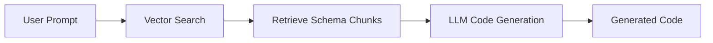

## Overview

When dealing with APIs that have large request and response schemas, generating code efficiently can be challenging. This post explores strategies to handle such scenarios, including modular design, chunking, and leveraging advanced techniques like Retrieval-Augmented Generation (RAG).

## Challenges with Large API Schemas

1. **Complexity**: Large schemas are harder to understand and maintain.
2. **Performance**: Processing large schemas can be resource-intensive.
3. **Scalability**: Generating code for multiple APIs with large schemas requires scalable solutions.

## Key Strategies

### 1. Chunking the Schema

Break the large schema into smaller, manageable chunks. This makes it easier to process and generate code for each part.

#### Example

```json
// Original Large Schema
{
  "user": {
    "id": "string",
    "name": "string",
    "address": {
      "street": "string",
      "city": "string",
      "zip": "string"
    }
  },
  "orders": [
    {
      "id": "string",
      "items": [
        {
          "productId": "string",
          "quantity": "number"
        }
      ]
    }
  ]
}

// Chunked Schema
{
  "user": { "id": "string", "name": "string" },
  "address": { "street": "string", "city": "string", "zip": "string" },
  "orders": [
    { "id": "string", "items": [{ "productId": "string", "quantity": "number" }] }
  ]
}
```

### 2. Modular Code Generation

Generate code for each chunk separately and then combine them into a cohesive system.

#### Example

```javascript
// User Module
export const UserSchema = {
  id: "string",
  name: "string",
};

// Address Module
export const AddressSchema = {
  street: "string",
  city: "string",
  zip: "string",
};

// Combine Modules
export const FullSchema = {
  user: UserSchema,
  address: AddressSchema,
};
```

### 3. Retrieval-Augmented Generation (RAG)

RAG can be used to dynamically retrieve relevant schema parts and generate code based on the prompt. This is particularly useful for large, knowledge-intensive schemas.

#### RAG Workflow

1. **Store Schema Chunks**: Use a vector database to store schema chunks with embeddings.
2. **Retrieve Relevant Chunks**: Query the database to retrieve only the relevant parts of the schema.
3. **Generate Code**: Use an LLM to generate code based on the retrieved chunks.

#### Example



### 4. Streaming Responses

For extremely large schemas, use streaming to process and generate code incrementally.

#### Example

```javascript
async function generateCode(schemaStream) {
  for await (const chunk of schemaStream) {
    const code = await generateCodeForChunk(chunk);
    console.log(code);
  }
}
```

### 5. Schema Validation and Optimization

Validate and optimize the schema before processing to reduce redundancy and improve efficiency.

#### Example

```javascript
function optimizeSchema(schema) {
  // Remove unused fields
  // Flatten nested structures
  return optimizedSchema;
}
```

## When to Use RAG vs Other Approaches

| **Scenario**                      | **Approach**            |
| --------------------------------- | ----------------------- |
| Schema is moderately large        | Chunking + Modular      |
| Schema is extremely large         | Streaming               |
| Schema is knowledge-intensive     | RAG                     |
| Schema requires frequent updates  | RAG                     |
| Schema is static and well-defined | Modular Code Generation |

## Best Practices

1. **Start Small**: Begin with a small part of the schema and scale up.
2. **Use Tools**: Leverage tools like OpenAPI, Swagger, or Postman for schema management.
3. **Iterate**: Continuously refine the schema and code generation process.
4. **Test**: Validate the generated code against the API to ensure correctness.

## Conclusion

Handling large API schemas requires a combination of strategies tailored to the specific challenges. By using chunking, modular design, RAG, and streaming, you can build a system that efficiently generates API code for any requirement.

---

_Choose the right approach based on your schema size, complexity, and requirements. With the right tools and techniques, even the largest schemas can be managed effectively._
